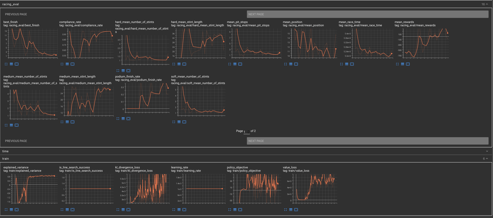
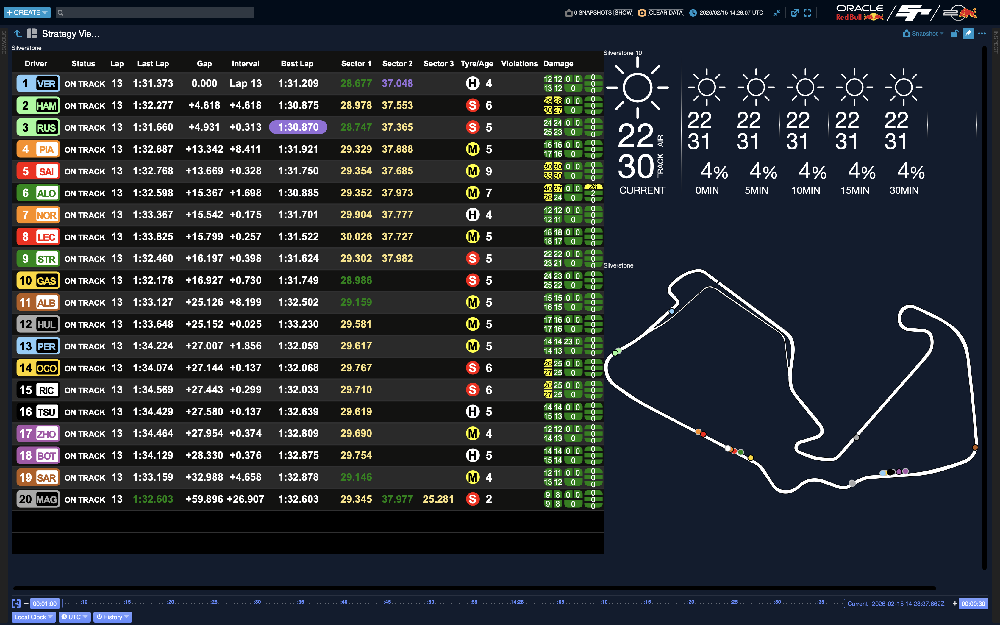
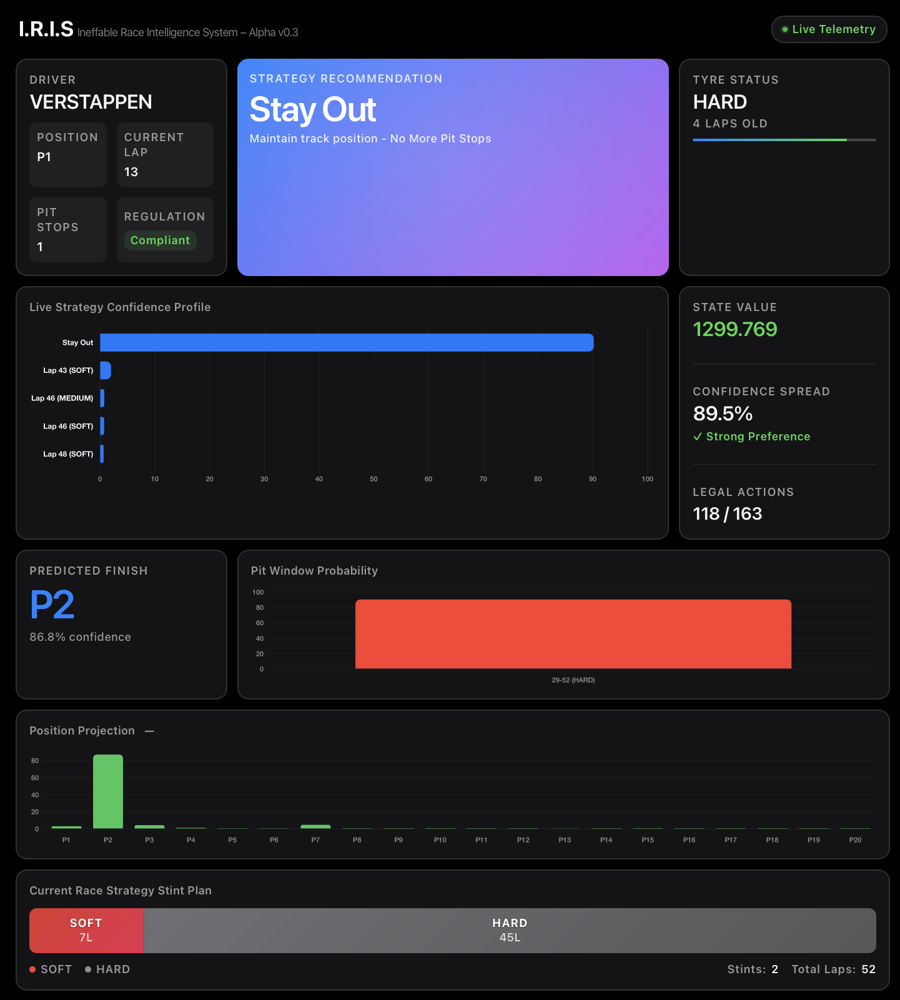
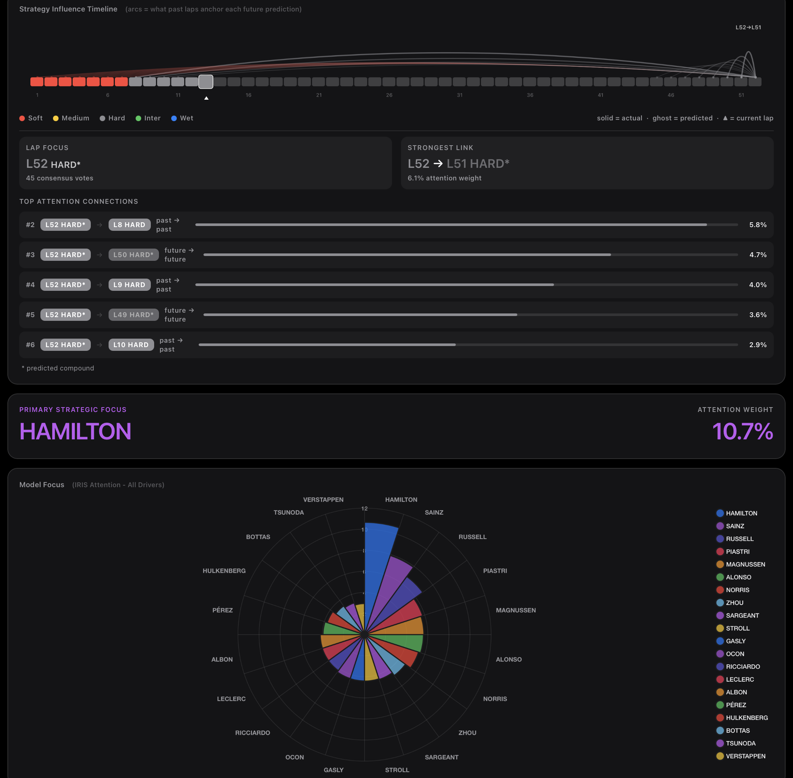

# Introduction
Research supported with Cloud TPUs from Google's TPU Research Cloud (TRC).
> [!NOTE]
> You do not require a TPU to utilise this repository. And to train networks for race strategy optimisation can be done on either CPU or GPU.

This repository contains techniques to aid in the optimisation of race strategy in Formula 1, including clean air optimisation, lap and time discrete race simulations, Monte Carlo simulations, and a reinforcement learning environment that adheres to the Gymnasium interface to train a neural network for strategy optimastion.

As this started as a research project, quick prototyping was prioritized. So future updates are expected to be breaking changes. For example, simulations are currently created using Python dictionaries in `simulation_parameters_example.py`. This approach will likely change once a more scalable API is developed, but it currently serves as a straightforward introduction to the project's core functionality.

## Installation

The code in repository was builted and tested on macOS and makes use of Python and Rust.
No knowledge of rust is required to use project. But understanding Rust will help in understanding of how the underlying engine works, as the project mainly makes use of Python as the interface for all logic with Rust handling the main computationally intensive tasks. Down the road I plan to rewrite the optimisation and combinatorics classes in rust but the API for Python use will remain the same.

### Rust Installation

This project requires Rust 2024 edition and cargo version 1.91 or higher. If you don't have Rust, follow the instructions at https://rust-lang.org/tools/install/:

**On macOS/Linux:**
```bash
curl --proto '=https' --tlsv1.2 -sSf https://sh.rustup.rs | sh
```
If you wish to learn more about the language visit: https://rust-lang.org

After installation, verify with:
```bash
rustc --version
cargo --version
```

If you already have Rust installed, update to the latest version:
```bash
rustup update
```

### Python Installation

You will need Python 3.13 or higher. Download from [python.org](https://www.python.org/downloads/) if needed.

Creating a virtual environment is must so backend of engine can work. If you don't know how you can follow 
the steps below:

#### Using pip
Create a virtual environment in the project root directory
```bash
python -m venv venv
```
Activate the virtual environment
On macOS/Linux:
```bash
source venv/bin/activate
```
Install requirements
```bash
pip install -r requirements.txt
```

#### Using uv
Create a virtual environment in the project root directory
```bash
uv venv
```
Activate the virtual environment
On macOS/Linux:
```bash
source .venv/bin/activate
```
Install requirements
```bash
uv pip install -r requirements.txt
```

#### Compile the Rust Backend
The project uses a Rust backend for performance-critical simulation components. Build and install the Rust module into your Python environment (maturin is included in `requirements.txt` and will have been installed in the previous step):
```bash
maturin develop --release
```
**Note:** The `--release` flag enables optimizations for production use. For development and testing new features, you can omit it for faster compilation times to simply:

```bash
maturin develop
```

>[!NOTE]
> For ease of getting started, when using Burn, this project uses the Candle backend as it is Rust-native and requires no additional setup. However, the CubeCL (also Rust-native) and LibTorch backends I have found to be significantly faster in some operations. So the default in the future will be CubeCL
>
> If you are on macOS using Tch / LibTorch in the backend and you get a "Library not loaded: @rpath/libtorch_cpu.dylib" try the following below:
```bash
export TORCH_LIB=$(python -c "import torch, os; print(os.path.join(os.path.dirname(torch.__file__), 'lib'))")
```
> followed by
```bash
export DYLD_LIBRARY_PATH=$TORCH_LIB:$DYLD_LIBRARY_PATH
```
> If the error still persists use rust native Ndarray, CubeCL or Wgpu that Burn provides. For further information about other operating systems check the
> Burn documention(https://github.com/tracel-ai/burn) or the tch-rs documentation(https://github.com/LaurentMazare/tch-rs#error-loading-shared-libraries)
### Running Examples

From the project root directory, navigate to the `python` directory:
```bash
cd python
```
Now you should be able to run some examples using the example data set in `simulation_parameters_example.py` file. 
You can change the tyre models for each of drivers and the race parameters in this file to see how it effects the race simulation
and strategy analysis.

>[!NOTE]
> Additionally, you can rename the drivers to the current grid, analyze historic data to derive the race configuration, and use
> practice session data to derive tyre models for the grid, and use this data as the simulation parameters for the race simulation
> or strategy analysis.

#### Driver Strategy Optimization
Explore how to define tyre models, configure driver consistency parameters, and generate optimal pit stop strategies in clean-air conditions:
```bash
python driver_example.py
```

#### Single Race Simulation
Run a complete race simulation with multiple drivers, pit stops, and overtaking dynamics:
```bash
python race_sim_example.py
```

#### Monte Carlo Strategy Analysis
Perform thousands of race simulations with randomized strategies to evaluate performance distributions and identify robust race strategies:
```bash
python monte_sims_example.py
```

#### Live Race Optimisation Demo
For live demo of short lap race with real-time strategy updates
This demonstrates how the system responds to Monte Carlo simulations running in the background and updates race predictions dynamically:

```bash
python live_strategy_example.py
```

Then in a separate terminal, launch the real-time visualization dashboard:

> [!TIP]
> When opening a new terminal window, if not automatically activated, remember to activate (not recreate) your virtual environment (see [Python Installation](#python-installation) section) and navigate to the `python` directory.
```bash
python real_time_example/real_time_display.py
```

# Reinforcement Learning

## Training a Network
Train a neural network to optimize race strategy.
The example uses the TRPO algorithm but can be switced to use other algorithms (PPO, A2C, DQN, etc.) and includes configurable parameters for training customization:

```bash
python trpo.py
```

Monitor training progress and network performance with TensorBoard:
```bash
tensorboard --logdir tensorboard_logs
```




>[!IMPORTANT]
> This research for this project is still ongoing. Additionally, features such as DRS are now obsolete and will be replaced with the functionality proposed in F1 once its effects are understood.
> There is still a need to add full course yellow features (safety car and virtual safety car), but this will only be added to time discrete simulation not the lap discrete.
> Features such multi agent reinforcement learning are also in the works were it possible to control both the teams cars, rather than the single driver optimisation

## I.R.I.S

I.R.I.S is the basis / research of an efficient model trained solely by self-play reinforcement learning. By leveraging Graph Neural Networks (GNNs) to represent drivers as nodes in a dynamic graph, I.R.I.S can handle varying grid sizes from F1's 20 cars to endurance racing's 60+ competitors with varying classes. and can easily adapt to the unpredictable nature of racing with DNFs and mid-race disruptions as graph structure naturally handles varying numbers of nodes without architectural changes.

It goes beyond what a standard RL racing system would provide by not just telling you if you should pit or not and what compound for only the current lap, but offering more nuanced strategic recommendations that span the whole race. It also displays current attention and strategic focus on competitors, and focuses on computational efficiency and principled learning by using the Gumbel planning approach.

### Live Telemetry - [NASA OpenMCT](https://nasa.github.io/openmct/)

The live telemetry dashboard is built on technologies provided by NASA and modified by Oracle - [Oracle Red Bull Racing ESports Realtime Player Analysis](https://www.youtube.com/watch?v=IrGACIMZiM0) - more information about the platform can be found here:
[OpenMCT Platform](https://www.openmct.com)


### Strategy Recommendation

### Attention Insights



## Resources

* **AlphaZero** - Mastering Chess and Shogi by Self-Play with a General Reinforcement Learning Algorithm  
  [Blog](https://deepmind.google/blog/alphazero-shedding-new-light-on-chess-shogi-and-go/) | [Paper](https://storage.googleapis.com/deepmind-media/DeepMind.com/Blog/alphazero-shedding-new-light-on-chess-shogi-and-go/alphazero_preprint.pdf)

* **TacticAI** - an AI Assistant for Football Tactics  
  [Blog](https://deepmind.google/blog/tacticai-ai-assistant-for-football-tactics/) | [Paper](https://www.nature.com/articles/s41467-024-45965-x)

* **Discovering State-of-the-art Reinforcement Learning Algorithms**   
  [Blog](https://google-deepmind.github.io/disco_rl/) | [Paper](https://www.nature.com/articles/s41586-025-09761-x)

* **MuZero** - Mastering Atari, Go, Chess and Shogi by Planning with a Learned Model  
  [Blog](https://deepmind.google/blog/muzero-mastering-go-chess-shogi-and-atari-without-rules/) | [Paper](https://arxiv.org/abs/1911.08265)

* **Gumbel MuZero** - Policy Improvement by Planning with Gumbel  
  [Paper](https://openreview.net/forum?id=bERaNdoegnO)

* **Stochastic MuZero** - Planning in Stochastic Environments with a Learned Model  
  [Paper](https://openreview.net/forum?id=X6D9bAHhBQ1)

---


